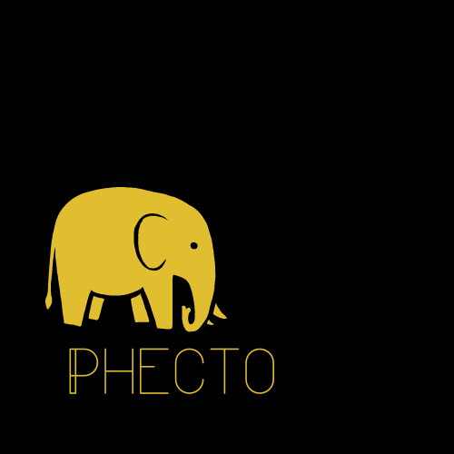

# Phecto



> That project consists in create a Changeset before all risky operations in database like: insert, update or delete.

### Improvements

The project is in development and the next updates will be these tasks:

- [ ] Create the Changeset Core Class
- [ ] Core PDO Class as Repository
- [ ] Create a Structure class to serve as Model

## 💻 Requirements

<!---Estes são apenas requisitos de exemplo. Adicionar, duplicar ou remover conforme necessário--->
* Installed `PHP 8.x`
* PDO and theirs extensions `pdo-sqlite; pdo-pgsql; pdo-mysql`

## 🚀 Installing Phecto

```
composer require phecto/phecto
```

## ☕ Usage

```php
<?php
    echo("Soon");
?>
```


## 📫 Contribute
To contribute with Phecto, follow this:

1. Fork that repository.
2. Create a branch: `git checkout -b <branch-name>`.
3. Do your changes and commit them: `git commit -m '<message>'`
4. Send to original branch: `git push origin phecto / <local>`
5. Create a pull request.

As alternative, go to Github documentation in [how to create a pull request](https://help.github.com/en/github/collaborating-with-issues-and-pull-requests/creating-a-pull-request).

## 📝 License

That project is under license. Read the file [LICENSE](LICENSE.md) for more details

[⬆ Back to the top](#Phecto)<br>
